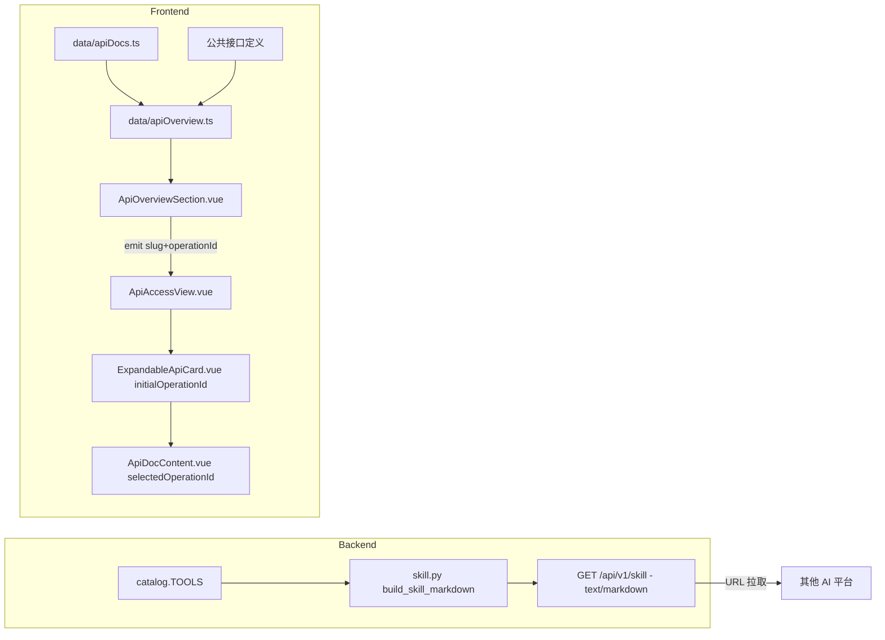

## 产品概述

Superbox 是一个在线开发工具箱，提供 JSON、Base64、URL、时间戳与图片 EXIF 等能力，全部运算由后端 API 完成。本次在现有“API 接入”页面新增一套“全部功能总览”，并对外提供一份官方 Skill，供其他 AI 平台按接口拉取。

## 核心功能

- 全部功能总览：在 API 接入页顶部统一列出所有对外端点（公共接口 + 5 个工具的全部操作），按分类分组、顺序呈现。
- 功能项信息：每项展示分类、请求方式（GET/POST）、接口路径（等宽字体）与一句话功能简介。
- 接入方式：支持一键复制接口路径与完整地址；工具类功能提供“在线测试”入口，直接打开对应工具详情卡片并定位到该操作，可就地测试。
- 官方 Skill：对外提供一份纯 Markdown 的官方 Skill，覆盖全部工具与公共接口、请求方式、请求/响应示例、统一错误契约与接入建议；其他 AI 平台可通过访问该接口获取这份 Skill。
- 视觉：与现有 API 接入页保持一致，沿用深/浅色主题与开发者工具风格，总览区块与下方工具卡片自然衔接，总览内容以轻微入场动效呈现。

## 边界与约束

- Skill 仅通过后端接口对外提供，本次不新增前端 Skill 展示页，也不发布静态文件。
- 采用单份统一 Skill，一次性覆盖全部能力。
- 不新增前端路由，总览作为 API 接入页的一个区块存在，因此无需改动 SPA 直达链接生成逻辑。

## 技术栈

- 后端：Python 3.12 + FastAPI（沿用现有 `backend/app` 结构），Skill 以 `text/markdown; charset=utf-8` 响应返回。
- 前端：Vue 3 + TypeScript + Vite + Tailwind CSS + GSAP（沿用现有 `frontend/src` 结构与设计令牌）。
- 测试：后端 pytest（`fastapi.testclient.TestClient`）；前端 `npm run typecheck`、`npm run build`。

## 实现方案

### 需求1：全部功能总览

- 数据来源遵循 DRY：在 `frontend/src/data/apiOverview.ts` 中，工具端点由现有 `apiDocs` 自动聚合（`apiDocs.flatMap(doc => doc.operations...)`），再补充公共接口（`GET /health`、`GET /tools`、`GET /tools/{slug}`、`GET /openapi.json`）的手工定义，统一导出 `apiOverview: ApiOverviewItem[]`。`ApiOverviewItem` 携带 `category / method / path / name / summary`，工具项额外带 `toolSlug + operationId` 以支持定位。
- 新增 `frontend/src/components/ApiOverviewSection.vue` 渲染总览：按分类分组，每行展示 method 徽章、路径、简介、复制按钮；工具行提供“在线测试”按钮，通过 emit 把 `{slug, operationId}` 上抛给 `ApiAccessView`。
- 深链定位：`ApiAccessView.vue` 扩展协调状态，在既有 `activeSlug` 基础上增加 `targetOperationId`；`ExpandableApiCard.vue` 新增可选 prop `initialOperationId`，透传给 `ApiDocContent.vue`；`ApiDocContent.vue` 新增可选 prop `initialOperationId`，用于初始化 `selectedOperationId`。保持“同时只展开一张卡片”的既有约束不变。
- 总览入场动效复用项目既有 GSAP 模式（`gsap.context` + 卸载清理 + `prefers-reduced-motion` 降级），与卡片展开动画风格一致。

### 需求2：官方 Skill

- 在 `backend/app/skill.py` 中维护一份结构化端点规格（公共接口 + catalog 中各工具的操作），并提供 `build_skill_markdown(base_url: str) -> str`，渲染为纯 Markdown（无 frontmatter），内容包含：概述与 Base URL、鉴权与请求约定（JSON / multipart）、按分类的全部端点（方法、路径、参数、请求/响应示例）、统一错误契约（400/404/413/422/503 及 `{code,message,details?}`）、面向 AI 的使用建议。工具名称/分类复用 `catalog.TOOLS`，示例措辞参考 `docs/*.md`，避免与前端 `apiDocs` 重复维护。
- 在 `backend/app/api.py` 新增 `GET /api/v1/skill`：注入 `Request`，以 `str(request.base_url)` 推导实际 `base_url`，返回 `Response(content=..., media_type="text/markdown; charset=utf-8")`，并声明 `responses={200: {"content": {"text/markdown": {}}}}` 以便 OpenAPI 正确标注。可选：对 `build_skill_markdown` 按 `base_url` 加 `lru_cache`（纯字符串拼接，开销可忽略，缓存仅作一致性优化）。
- 在 `docs/README.md` 公共接口清单补充该端点说明；根 `README.md` 的 API 接入段落可补充一句 Skill 端点指引。

### 关键技术决策与权衡

- Skill 放在后端并由请求推导 Base URL：保证对外示例中的地址与部署环境一致，优于将固定域名写死；字符串拼接成本极低，无性能顾虑。
- 总览数据从 `apiDocs` 派生而非另建一份完整清单：新增工具时仅需按既有流程更新 `apiDocs`，总览自动同步，降低漂移风险。
- 采用“区块”而非新页面：复用 `/api-access` 的布局与卡片体系，零路由改动，避免触碰 `generate-spa-fallbacks.mjs`。

### 架构与数据流



## 实现要点（执行细节）

- 复用现有数据与组件：总览不复制 `apiDocs` 内容；`ApiOverviewSection` 复用既有 Tailwind 令牌（`border-slate-200 / dark:border-white/10`、`bg-white / dark:bg-[#141a2c]`、`text-indigo-600 / dark:text-indigo-400`、`font-mono`）。
- 兼容性：对 `/api-access` 与既有卡片行为保持向后兼容；新增 prop 均为可选，老用法不受影响。
- 动效与可访问性：GSAP 动画须在 `onBeforeUnmount` 清理，并在 `prefers-reduced-motion: reduce` 时直接落位；总览按钮保持键盘可达与 `aria-label`。
- 错误契约一致性：Skill 中的错误码/HTTP 状态须与 `main.py` 异常处理器、`docs/README.md` 完全一致，避免文档漂移。
- 路由：本次不新增路由，无需修改 `frontend/scripts/generate-spa-fallbacks.mjs`。

## 目录结构

```
Superbox/
├── backend/
│   ├── app/
│   │   ├── skill.py                 # [NEW] build_skill_markdown(base_url) 与结构化端点规格。渲染覆盖公共接口、全部工具操作、错误契约与使用建议的纯 Markdown；工具名/分类复用 catalog.TOOLS。可选按 base_url 加 lru_cache。
│   │   └── api.py                   # [MODIFY] 新增 GET /api/v1/skill（注入 Request 推导 base_url，返回 text/markdown; charset=utf-8，声明 200 media type）。
│   └── tests/
│       └── test_api.py              # [MODIFY] 新增 skill 测试：200、content-type 含 text/markdown、正文包含关键路径（如 /json/format、/exif/edit）与错误码（INVALID_INPUT、VALIDATION_ERROR）。
├── docs/
│   └── README.md                    # [MODIFY] 公共接口清单补充 GET /api/v1/skill 的用途与返回格式说明。
├── frontend/
│   └── src/
│       ├── data/
│       │   └── apiOverview.ts       # [NEW] 定义 ApiOverviewItem；由 apiDocs 聚合工具端点 + 手工补充公共接口，导出 apiOverview 列表与分组辅助函数。
│       ├── components/
│       │   ├── ApiOverviewSection.vue  # [NEW] 总览区块：按分类分组渲染 method 徽章/路径/简介/复制/在线测试入口；GSAP 入场动效与 reduced-motion 降级；向父级 emit {slug, operationId}。
│       │   ├── ExpandableApiCard.vue   # [MODIFY] 新增可选 prop initialOperationId，透传给 ApiDocContent；不改变现有动画与焦点逻辑。
│       │   └── ApiDocContent.vue       # [MODIFY] 新增可选 prop initialOperationId，用于初始化 selectedOperationId，实现定位到指定操作。
│       └── views/
│           └── ApiAccessView.vue       # [MODIFY] 顶部插入 ApiOverviewSection；扩展协调状态（activeSlug + targetOperationId），处理“在线测试”定位并保持单卡展开约束。
└── README.md                        # [MODIFY] （可选）在 API 接入段落补充 Skill 端点指引。
```

## 设计风格

延续现有 API 接入页的开发者工具风格：以中性 slate 为底、indigo 为强调色，支持深/浅色主题，代码路径使用等宽字体，接口信息以“method 徽章 + 路径 + 简介”的紧凑行呈现，强调信息密度与可扫描性。

## 页面规划（在既有 /api-access 页内新增一个区块）

1. 页头（已有）：保留 “SUPERBOX / DEVELOPERS · API 接入” 标题与 BASE URL 展示，作为总览与卡片体系的上文。
2. 全部功能总览（新增区块，位于“选择接口能力”标题之前）：

- 区块标题“全部功能总览”+ 端点总数徽章（如 `16 ENDPOINTS`）+ 一句副标题“完整能力清单，点击即可查看接入方式或在线测试”。
- 分组列表：按“公共接口 / 数据处理 / 编码转换 / 时间日期 / 图片处理”等分类分组，每组一行小标题与计数。
- 功能行：左侧 method 徽章（GET 用 slate、POST 用 indigo 以区分），中间等宽路径与功能简介，右侧操作按钮（复制路径 / 在线测试）。
- 行悬停：轻微背景与边框变化、indigo 强调，点击“在线测试”平滑滚动并打开对应工具卡片的指定操作。

3. 选择接口能力（已有）：保留工具卡片网格与展开动画，总览与卡片之间以分隔线与留白衔接。
4. 卡片详情（已有）：展开后的接口导航、字段、示例、在线测试与 AI 提示词区域保持不变，支持被总览深链定位到具体操作。

## 交互与响应式

- 入场：总览列表以 GSAP 做轻微错峰淡入上移（stagger），`prefers-reduced-motion` 时直接落位。
- 桌面：分组行单列纵向排布，方法徽章定宽、简介可换行，操作按钮右对齐。
- 移动：方法徽章与路径同排，简介下移，操作按钮占满下一行，保证点按区域充足。
- 主题：深色下使用 `#0c1020/#141a2c` 面板与 `white/10` 边框，浅色下使用 `white` 面板与 `slate-200` 边框，与现有卡片一致。

## Agent Extensions

### Skill

- **gsap-frameworks**
- Purpose: 为 Vue 环境下的总览区块提供生命周期安全、可清理的 GSAP 入场动画实现方式（onMounted/onBeforeUnmount、context 作用域）。
- Expected outcome: `ApiOverviewSection.vue` 的错峰淡入上移动画实现正确、无内存泄漏，组件卸载后动画上下文被完整清理。
- **gsap-core**
- Purpose: 提供核心动画 API 用法（gsap.to/from、easing、stagger、defaults）以匹配项目现有动画风格。
- Expected outcome: 总览入场动画的缓动与 stagger 参数与既有卡片展开动画一致，且在 `prefers-reduced-motion` 下正确降级。